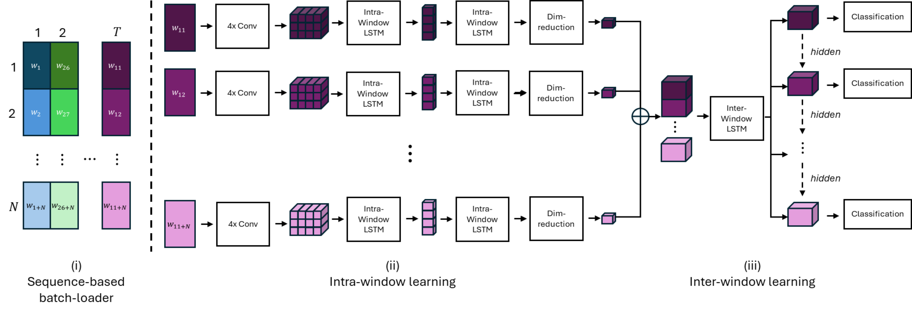

# DeepConvContext: A Multi-Scale Approach to Timeseries Classification in Human Activtiy Recognition 



## Abstract
Despite recognized limitations in modeling long-range temporal dependencies, Human Activity Recognition (HAR) has traditionally relied on a sliding window approach to segment labeled datasets. Deep learning models like the DeepConvLSTM typically classify each window independently, restricting learnable temporal context to within-window information and producing fragmented, temporally incoherent activity timelines. To address this constraint, we propose *DeepConvContext*, a multi-scale time series classification framework for HAR. Drawing inspiration from the vision-based Temporal Action Localization community, DeepConvContext models both intra- and inter-window temporal patterns separately by processing sequences of time-ordered windows. Across six widely-used HAR benchmarks, DeepConvContext achieves an average 5% improvement in 1F1-score and up to 18-point improvement in mAP over related approaches, while achieving latency and throughput comparable to prior methods that extend temporal context through hidden state propagation across batches. Our quantitative and qualitative analysis underline the importance of inter-window learning and show how it produces more coherent activity segments even in online prediction scenarios.

## Additional Results Material
Additional confusion matrices of all mentioned experiments can be found in the `confusion_matrices` folder.

## Installation
Create [Anaconda](https://www.anaconda.com/products/distribution) environment:

```
conda create -n deepconvcontext python==3.12.2
conda activate deepconvcontext
```

Install PyTorch distribution (CUDA 12.4):

```
pip3 install torch==2.5.1
```

Install other packages:

```
pip install -r requirements.txt
```


## Download
The datasets used for conducting experiments can be downloaded [here](https://uni-bonn.sciebo.de/s/npJCrdb26RBGmFk).

## Reproduce Experiments
Once having installed requirements, one can rerun experiments by running the `main.py` script, passing config files for model, dataset and training configurations:

````
python main.py --dataset_cfg ./configs/dataset/sbhar.yaml --model_cfg ./configs/model/deepconvcontext.yaml --training_cfg ./configs/training/causal_sequence_deepconvcontext.yaml --seed 1
````

To rerun the experiments without changing anything about the config files, please place the complete dataset download into a folder called `data` in the main directory of the repository. The folder `job_scripts` contains collections of commands of all experiments.

## Recompute metrics and figures
To recreate confusion matrices as well as compute scoring metrics mentioned in the paper, please run `compute_metrics.py`.

## Logging using Weights & Biases
In order to log experiments to [wandb.ai](https://wandb.ai) please provide relevant information in your local deployment (see `main.py`)